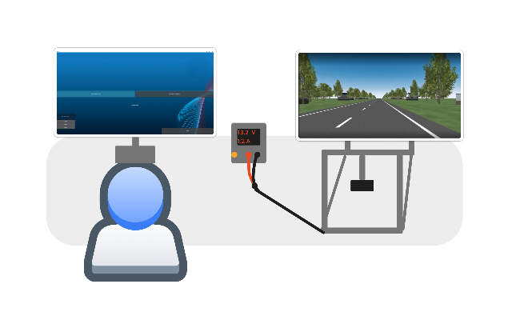
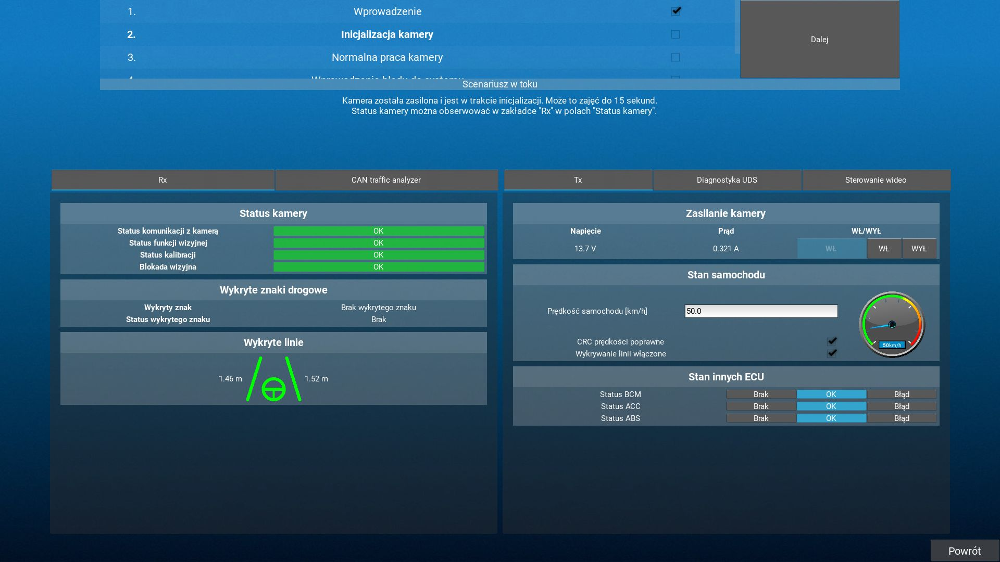
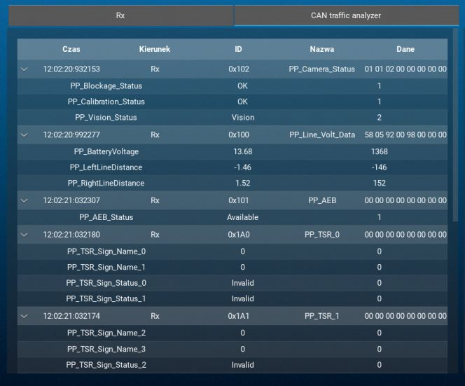
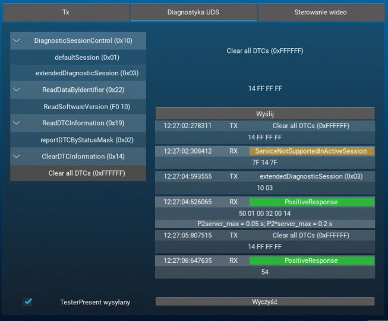
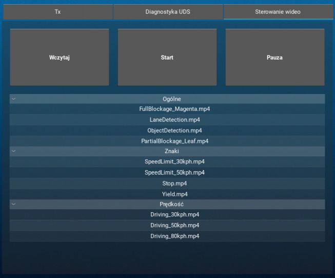
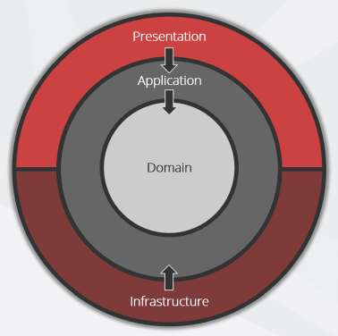
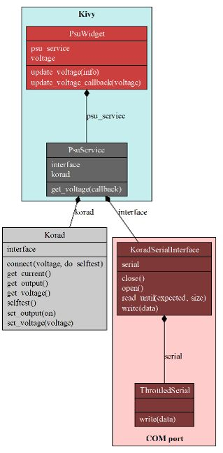

# ADAS Learning Platform

## Overview

The ADAS Learning Platform is an interactive educational tool designed to teach users about Advanced Driver Assistance Systems (ADAS) and automotive diagnostics. This project provides a hands-on learning experience for understanding the intricacies of modern vehicle systems, particularly focusing on camera-based ADAS technologies.

The project was developed in cooperation with Lodz University of Technology, Department of Microelectronics and Computer Science.

### Authors

- Mateusz Dionizy
- Jakub Adamczyk

## User Perspective

From a user's standpoint, this platform offers an opportunity to:

- Explore real-world scenarios related to ADAS systems
- Learn about automotive diagnostics, including Unified Diagnostic Services (UDS)
- Interact with simulated vehicle systems and camera feeds
- Troubleshoot and solve problems in a controlled, educational environment
- Gain practical experience with CAN bus communication and diagnostic tools
- Understand failsafe mechanisms and their importance in automotive safety

Users can engage with various tutorials and challenge scenarios, each designed to build knowledge and skills relevant to modern automotive technologies. The platform provides a safe, simulated environment for learning without the risks associated with real vehicle diagnostics.

*Use case of the application. User interacts with kiosk-like setup on one monitor, while the second monitor shows video feed for the camera ADAS system*

## Core Features

1. **Scenario-based Learning**: Offers a structured approach to learning through predefined scenarios. 

- In tutorial scenarios, users progress through a series of steps, each designed to teach specific aspects of ADAS and automotive diagnostics. 
- In challenge scenarios, users are given tasks such as diagnosing and fixing issues or answering technical questions based on their findings.
- Modular construction of the scenario runner and flexible scenario template allows to easily add new scenarios.

2. **CAN Bus Simulation**: Implements a virtual CAN bus for realistic vehicle communication simulation. 

- TX widgets allow users to control input signals of the ADAS system (e.g. power supply, vehicle speed, other ECU status)
- RX widgets display signals sent by the ADAS system (e.g. system health, detected traffic signs, lateral control system status)

*Main window overview. Step list at the top, RX widgets on the left, TX widgets on the right*

3. **CAN Traffic Analyzer**: Provides a detailed view of CAN bus traffic, allowing users to analyze both raw and decoded CAN frames.

*CAN Traffic Analyzer*

4. **UDS Diagnostics**: Simulates a diagnostic environment for learning about automotive troubleshooting. Users can send diagnostic requests, interpret responses, and practice common diagnostic procedures.

*UDS Diagnostics*

5. **Video Playback**: Simulates camera feeds for visual ADAS demonstrations, giving users a way to manipulate what ADAS system can "see". The available videos were chosen to highlight key ADAS features such as:
- Lane Detection
- Traffic Sign Recognition
- Failsafe response to vision blockage

*Video Playback*

## Architecture

The project follows Clean Architecture principles, separating concerns into distinct layers:

1. **Presentation (UI) Layer**: Implemented using Kivy and KivyMD for a responsive and interactive user interface.
2. **Application Layer**: Manages the business logic, scenario execution, and interaction between the UI and domain layers.
3. **Domain Layer**: Contains the core logic for ADAS functionalities, CAN communication, and diagnostic services.
4. **Infrastructure Layer**: Handles low-level operations such as serial communication and hardware interfacing.

*Clean Architecture overview - [SSW.Rules | Rules to Better Clean Architecture](https://ssw.com.au/rules/rules-to-better-clean-architecture/)*

*Clean Architecture example - power supply implementation*

## Technologies Used

- **Python**: Primary programming language
- **Kivy & KivyMD**: UI framework
- **python-can**: CAN bus simulation
- **udsoncan**: UDS protocol implementation
- **OpenCV**: Video processing for simulated camera feeds
- **pytest**: Testing framework
- **GitLab CI**: Continuous Integration

## Setup and Installation

> [!WARNING]  
> This repository does not include runtime assets due to copyright restrictions. It serves solely as a historical archive and write-up of the project, and will not function in its current state.

1. Install **Python 3.11**.
2. Install project dependencies: `python -m pip install -r requirements.txt`.
    - Install additional dependencies manually (in `requirements.txt`: **Kivy** and **PyOpenGL**).
3. Setup `.env` file according to the example.
4. Run `python ./zalp/ui/main.py`.
    - Use `PYTHONUNBUFFERED=1` for lower real-time latency.
